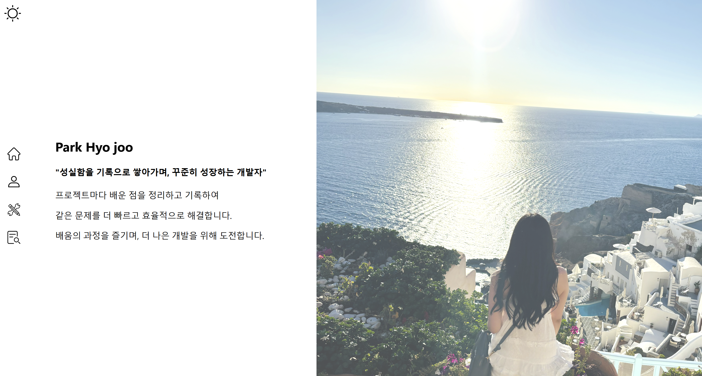

  
➡️[HJ-Portfolio 웹 주소](https://hj-portfoli0.netlify.app/)  

  

## 📑 목차  
📖 [프로젝트 개요]() 
⚙️ [개발환경 및 기술 스택](https://github.com/704hj/HJ-Portfolio/tree/main#%EF%B8%8F-%EA%B0%9C%EB%B0%9C%ED%99%98%EA%B2%BD-%EB%B0%8F-%EA%B8%B0%EC%88%A0-%EC%8A%A4%ED%83%9D) 
😊 [담당 기능](https://github.com/704hj/HJ-Portfolio/tree/main#-%EB%8B%B4%EB%8B%B9-%EA%B8%B0%EB%8A%A5) 
💡 [문제 해결](https://github.com/704hj/HJ-Portfolio/tree/main#-%EB%AC%B8%EC%A0%9C-%ED%95%B4%EA%B2%B0) 
❓ [느낀 점](https://github.com/704hj/HJ-Portfolio/tree/main#-%EB%8A%90%EB%82%80-%EC%A0%90) 

  

## 📖 프로젝트 개요

**1. 소개**  
  - **이름** : HJ-Portfolio  
  - **개요** : React를 학습하여 웹 포트폴리오 개발  
  - **작업기간** : 2024/12/31 ~ 2025/02/21  
  - **팀원구성** : 개인 프로젝트 (1명)  

**2. 목표**  
  - React를 독학하여 성공적으로 프로젝트를 완성하며, 새로운 기술을 학습하고 적용하는 능력 향상  
  - React 기반 웹 포트폴리오를 개발하고, 실제 배포까지 완료하는 것이 목표  

**3. 주요 기능**  
  - 개발자 및 기술 스택 소개 페이지 구현  
  - 수행한 프로젝트 동영상을 삽입하고 실행할 수 있도록 구성  
  - 다크모드 구현  
  - 반응형 웹 (미디어쿼리) 완벽 적용  

  

## ⚙️ 개발환경 및 기술 스택  

- **개발 환경**  
  - **OS** : Windows 11  
  - **Service System** : React.js  
  - **배포 환경** : Netlify (CI/CD 자동화 배포)  

- **사용 기술**  
    
    
    
    
    
    

  

## 😊 담당 기능

**1. 메인 페이지**  
  - 전체적인 UI/UX 디자인을 직접 기획하고 개발  
  - React의 컴포넌트 구조를 이해하고, 컴포넌트 단위로 UI 설계  
  - 사이드 네비게이션바 구현  
  - Smooth Scroll 적용으로 각 섹션(홈, 기술 스택, 프로젝트 등) 간 부드러운 이동  
  - 다크모드 적용 및 밝은 색 아이콘 자동 변경 기능  

 

**2. 기술 스택 페이지**  
  - 기술 아이콘에 hover 효과 추가  
  - 특정 기술에 마우스를 올리면 해당 기술의 활용 사례를 표시  

 

**3. 프로젝트 페이지**  
  - 각 프로젝트를 동영상으로 기록하여 삽입  
  - React를 활용하여 동영상 실행 가능하도록 구성  
  - 기존 이미지 삽입 방식 대신 <video> 태그를 활용하여 동영상 재생  
  - 각각의 재생 버튼을 개별 설정하여 특정 동영상만 실행되도록 구현  

 

**4. 다크모드 기능**  
  - useState, useEffect를 활용하여 다크모드 상태 관리  
  - LocalStorage를 활용하여 새로고침 후에도 다크모드 설정 유지  
  - UI 디자인을 고려하여 가독성이 좋은 색상 조합 적용  

  

## 💡 문제 해결

**[다크 모드 상태 유지 기능 개선]**  

- **문제점**  
  - 다크 모드를 useState로 관리했으나, 페이지 새로고침 시 초기화되는 문제 발생  
  - 사용자의 다크 모드 설정을 저장할 수 없어 일관된 사용자 경험 제공이 어려움  

- **해결 과정**  
  - LocalStorage를 활용하여 사용자의 다크 모드 설정을 저장  
  - useEffect를 사용하여 페이지 로드시 LocalStorage에서 기존 설정을 불러오도록 구현  
  - 다크 모드 변경 시에도 LocalStorage 값을 업데이트하여 새로고침 후에도 설정 유지  

- **결과 및 성과**  
  - 새로고침 후에도 기존 설정 유지 가능하여 일관된 사용자 경험 제공  
  - 상태 관리 (useState)와 LocalStorage의 연계를 학습하며, 데이터 지속성을 고려한 개발 능력 향상  
  - 사용자의 편의성과 유지보수성을 고려한 개발 습관 형성  

  

## ❓ 느낀 점

- **웹 포트폴리오 개발 도전과 성장**  
  - React를 독학하며 구조를 익히고 상태 관리를 학습하며 발전  
  - 기존의 정적 웹사이트와 차별화된, 동적인 웹 포트폴리오를 구현하며 배우는 과정이 흥미로웠음  
  - 빠르게 새로운 기술을 습득하고 적용하는 경험을 통해 자신감을 얻음  

- **반응형 웹 디자인의 복잡함과 중요성**  
  - 단순히 화면 크기를 조정하는 것이 아닌, 사용자 경험(UX)을 고려한 레이아웃과 동적인 요소들을 함께 설계하는 과정이 필요했음  
  - 미디어 쿼리와 CSS Flex/Grid를 조합하여 다양한 화면 크기에 대응  
  - 모바일, 태블릿, PC 화면에서 디자인이 무너지지 않도록 여러 번 테스트하고 조정  

  

➡️[프로젝트 일지](https://www.notion.so/HJ-Portfolio-1a08913a4d2780039ee8d6dc8cf1482b)  

